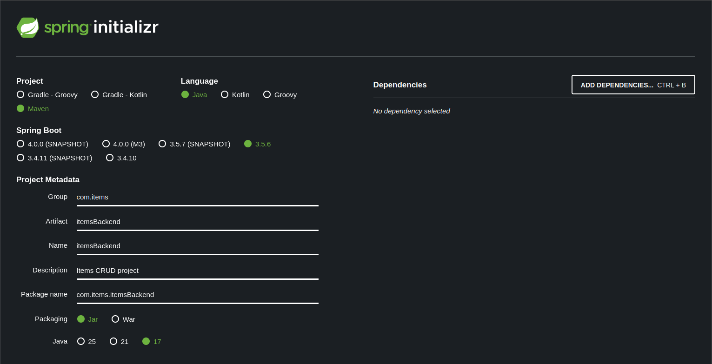

# ItemsApp. SpringBoot, MySQL + Docker + AWS

Track followed to develop the ItemsApp Spring Boot application, using a MySQL database and deployed in an AWS machine using Docker containers.

## SpringBoot backend development

+ [TUTORIAL](https://medium.com/javarevisited/building-a-secure-restful-user-crud-with-spring-boot-a-step-by-step-guide-486ed3fd4e5a)

1. Set up the project using **spring initializer** 



2. Add the following dependencies to **pom.xml**

    - **Web:** Used to create endpoints and handle requests/responses.

    ```Java
    <dependency>
       <groupId>org.springframework.boot</groupId>
       <artifactId>spring-boot-starter-web</artifactId>
    </dependency>
    ```   

    - **Data JPA:** Used to interact with database, define JPA entities (data models), perform CRUD operations, and execute custom queries.

    ```Java
    <dependency>
       <groupId>org.springframework.boot</groupId>
       <artifactId>spring-boot-starter-data-jpa</artifactId>
    </dependency>
    ```

    - **mySQL:** Used to stablish connection with the mySQL database, execute SQL queries and manage database transactions.

    ```Java
    <dependency>
       <groupId>mysql</groupId>
       <artifactId>mysql-connector-java</artifactId>
       <version>8.0.33</version>
       <scope>runtime</scope>
      </dependency>
    ```

    - **Lombok:** Lombok annotations (@Data, @Getter, @Setter) in our Java classes to automatically generate common methods.

    ```Java
    <dependency>
       <groupId>org.projectlombok</groupId>
       <artifactId>lombok</artifactId>
       <optional>true</optional>
    </dependency>
    ```

    - **Validation:** Annotate Java model classes with validation constraints (@NotBlank, @NotNull, @Size).

    ```Java
    <dependency>
       <groupId>org.springframework.boot</groupId>
       <artifactId>spring-boot-starter-validation</artifactId>
    </dependency>
    ```

3. Update application.properties file

    ```Java
    spring.jpa.hibernate.ddl-auto=update
    spring.datasource.url=jdbc:mysql://localhost:3306/itemsapp
    spring.datasource.username=itemsadmin
    spring.datasource.password=password
    spring.datasource.driver-class-name=com.mysql.cj.jdbc.Driver
    ```

4. Create Database and user to access the service during the backend testing

    I'll be using **MariaDB** as client to provisionally test the backend.

    ```sql
    create database itemsapp;
    use itemsapp;
    CREATE USER 'itemsadmin'@'localhost' identified by 'password';
    GRANT ALL PRIVILEGES ON itemsapp.* to 'itemsadmin'@'localhost';
    FLUSH PRIVILEGES; 
    ```

5. Create project structure

    - **Models:** Define the structure and attributes of the data entities the application manages.

        - For example the **Item** model might include attributes like `id`, `name`, `section`, `price` and `stock`

        - Models often include annotations or custom logic to validate the data: @NotBlank, @Email or @Size to enforce constraints

        - Models are typically mapped to the database using **Object-Relational-Mapping (ORM)** frameworks like Hibernate in Spring Boot. They define the structure of database tables and establish relationship between entities.

    - **DTOs (Data Transfer Objects):** Provide a flexible and efficient mechanism for transferring data between layers (Client and Server).

        - Optimize performance

        - Encapsulate business logic

        - Ensure compatibility

        - Enhace security and privacy

    - **Exception Classes:** Custom exceptions to improve clarity and mantainability of the code providing specific error handling for common scenarios in CRUD.
    
        - Allow handle exceptional cases gratefully and communicate errors effectively

    - **Repository Interface:** Repository Interfaces abstract the details of data access. Instead of directly interacting with data storage mechanisms (like DBs) repository interfaces are defined to declare common methods.

        - JPA (Java Persistent API) Repository is a part of Spring Data JPA and provides CRUD operations for the entities.

        - The first parameter indicates the entity class that the repository manages.

        - The second parameter indicates the type of primary key that the entity has.

        - \* An entity is a lightweight persistence domain object, typically representing a table in a relational database. 

    - **Service Classes:** Serve as the backbone for implementing business logic, managing transactions, abstracting data access, centralizing business rules, promoting reusability, and handling errors effectively.

        - By placing service classes, the rules governing the application behaviour are centralized.

        - Easier to mantain and modify the behavior of the application.

        - No need to modify dispersed code when trying to change a functionality.

    - **Controller:** Handles incoming HTTP requests and returns appropiate HTTP responses. 

        - Sometimes delegates business logic to service classes.

        - Tipically annotated with @RestController or @Controller.

        - Methods that handle specific HTTP requests. Annotated with @GetMapping, @PostMapping, @PutMapping, @DeleteMapping or similar. 

        - Each method represents an endpoint.

        - Often rely on service classes to perform business logic. Dependencies are typically injected with @Autowired annotation.

        - Controller methods return the response to the client. This can be done returning a `ResponseEntity` to have more control over the response status code, headers and body.

    - **Exception Handler Class:** Exception handlers in Spring Boot are used to handle exceptions thrown during the process of HTTP requests. 

        - Centralize error handling logic and provide custom responses.

        - @RestControllerAdvice annotation used to indicate the class contains advice that applies to all controllers.

        - To create exception handler, the method is annotated within a controller class with @ExceptionHandler and specify the types of exceptions it can handle. 
    
* An **Annotation** in Java is a special kind of metadata, a ***label*** or ***instruction*** attached to the code to tell the compiler or framework how to treat the code. 
    
    - Spring Boot relies heavily in annotations to define what things are and how they behave. Instead of writing a lot of XML configuration.

* **Lombok** is a Java Library that also uses annotations, but instead telling Spring Boot what to do, Lombok tells directly to the compiler to automatically build boilerplate code.

* **Bean** is an instance of a Java class that is created, configured, and managed by the Spring IOC container. Every bean is an object, but not every object is a bean.
    - Using a bean dependencies can be injected automatically using autowired .
    - A bean can be declared using Stereotype Annotations (@Component, @Service, @Repository, @Controller)